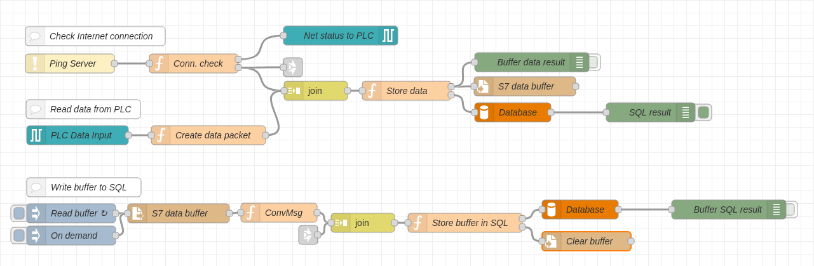

# NodeRed-SQL-Connector
Przykład aplikacji stworzonej w środowisku Node-Red, do realizacji wymiany danych pomiędzy sterownikiem SIMATIC S7 i baza danych MySQL. Wspierane są wszystkie sterowniki obsługujące protokół komunikacyjny S7 (S7-300/400/1200/1500).

## Opis aplikacji
Aplikacja wykorzystuje protokół komunikacyjny S7 do komunikacji ze sterownikami PLC. Odczytane w ten sposób wartości mogą być zapisane do bazy danych MySQL. W przypadku utraty połączenia z serwerem SQL, dane gromadzone są w buforze generowanym w postaci pliku TXT. Połączenie to jest monitorowane co 5s, a bufor przepisywany jest do bazy maksymalnie z 15-minutowym opóźnieniem.



## Instalacja
Do uruchomienia przykładu aplikacji wymagana jest instalacja środowiska programistycznego Node-Red. Instrukcja instalacji dostępna jest w [oficjalnej dokumentacji środowiska](https://nodered.org/docs/getting-started/local).

Środowisko Node-Red oraz aplikacja mogą być uruchomione na platformach z systemem operacyjnym Windows lub Linux, np. urządzeniach:
- [SIMATIC IOT2040](https://support.industry.siemens.com/cs/us/en/view/109741795)
- [SIMATIC IOT2050](https://support.industry.siemens.com/cs/us/en/view/109779394)
- [SIMATIC IPC127E](https://support.industry.siemens.com/cs/us/en/view/109765133)

W aplikacji wykorzystano następujące funkcje (nodes) dostępne do pobrania z biblioteki środowiska Node-Red:
- [node-red-contrib-s7](https://flows.nodered.org/node/node-red-contrib-s7)
- [node-red-node-mysql](https://flows.nodered.org/node/node-red-node-mysql)
- [node-red-node-ping](https://flows.nodered.org/node/node-red-node-ping)

Powyższe funkcje musza być zainstalowane przed uruchomieniem przykładu aplikacji. Instalację można wykonać przy użyciu menadżera pakietów *npm*, wpisując w terminalu komendę:
```
sudo npm install node-red-contrib-s7 && npm install node-red-node-mysql && npm install node-red-node-ping
```

Możliwa jest również instalacja bezpośrednio w środowisku graficznym, wybierając z menu głównego Node-Red opcję *Manage Palette -> Pallete -> Install*. W pasku wyszukiwania należy wpisać nazwę każdej z w/w funkcji, a po pojawieniu się wyniku kliknąć przycisk *Install*.


