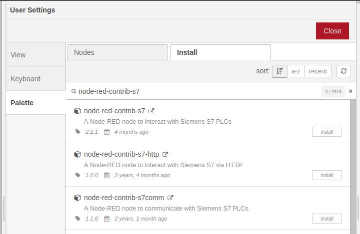
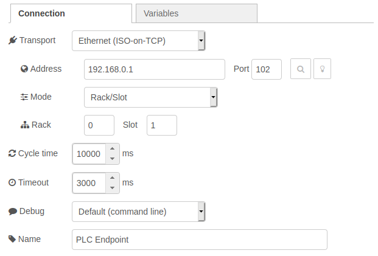
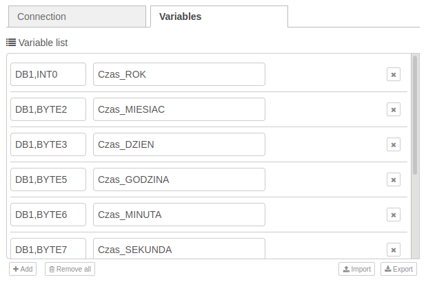

# NodeRed-SQL-Connector
Przykład aplikacji stworzonej w środowisku Node-Red, do realizacji wymiany danych pomiędzy sterownikiem SIMATIC S7 i baza danych MySQL. Wspierane są wszystkie sterowniki obsługujące protokół komunikacyjny S7 (SIMATIC S7-300/400/1200/1500).

## Opis aplikacji
Aplikacja wykorzystuje protokół komunikacyjny S7 do komunikacji ze sterownikami PLC. Odczytane w ten sposób wartości mogą być zapisane do bazy danych MySQL. W przypadku utraty połączenia z serwerem SQL, dane gromadzone są w buforze generowanym w postaci pliku TXT. Połączenie to jest monitorowane co 5s, a bufor przepisywany jest do bazy maksymalnie z 15-minutowym opóźnieniem.


## Instalacja
Do uruchomienia przykładu aplikacji wymagana jest instalacja środowiska programistycznego Node-Red. Instrukcja instalacji dostępna jest w [oficjalnej dokumentacji środowiska](https://nodered.org/docs/getting-started/local).

Środowisko Node-Red oraz aplikacja mogą być uruchomione na platformach z systemem operacyjnym Windows lub Linux, np. urządzeniach:
- [SIMATIC IOT2040](https://support.industry.siemens.com/cs/us/en/view/109741795)
- [SIMATIC IOT2050](https://support.industry.siemens.com/cs/us/en/view/109779394)
- [SIMATIC IPC127E](https://support.industry.siemens.com/cs/us/en/view/109765133)

W aplikacji wykorzystano następujące funkcje (nodes) dostępne do pobrania z biblioteki środowiska Node-Red:
- [node-red-contrib-s7](https://flows.nodered.org/node/node-red-contrib-s7)
- [node-red-node-mysql](https://flows.nodered.org/node/node-red-node-mysql)
- [node-red-node-ping](https://flows.nodered.org/node/node-red-node-ping)

Powyższe funkcje musza być zainstalowane przed uruchomieniem przykładu aplikacji. Instalację można wykonać przy użyciu menadżera pakietów *npm*, wpisując w terminalu komendę:
```
sudo npm install node-red-contrib-s7 && npm install node-red-node-mysql && npm install node-red-node-ping
```

Możliwa jest również instalacja bezpośrednio w środowisku graficznym, wybierając z menu głównego Node-Red opcję *Manage Palette -> Pallete -> Install*. W pasku wyszukiwania należy wpisać nazwę każdej z w/w funkcji, a po pojawieniu się wyniku kliknąć przycisk *Install*.



Po instalacji wszystkich wymaganych pakietów, możliwy jest import aplikacji do środowiska wybierając z menu głównego opcję *Import -> select a file to import -> 'SQL_Connector.json' -> Import*.

## Konfiguracja
Przed uruchomieniem aplikacji należy dostosować parametry związane z połączeniem ze sterownikiem PLC (parametry połączenia, lista zmiennych) oraz bazą danych (parametry połączenia, zapytanie SQL).

### Parametry połączenia z PLC
Parametry komunikacyjne oraz listę zmiennych można dostosować klikając na jeden z bloków programu *PLC Data Input* lub *Net status to PLC*, a nastepnie na ikonę ołówka przy nazwie PLC.


W wyświetlonym oknie w zakładce *Connections* należy dostosować przede wszystkim adres IP sterownika oraz czas cyklu odczytu zmiennych.



W zakładce *Variables* należy zdefiniować listę zmiennych czytanych ze sterownika PLC. Zmienna definiowana jest poprzez adres absolutny w sterowniku oraz nazwę symboliczną (wykorzystywaną jedynie w Node-Red - nie musi być to nazwa identyczna jak w PLC). Sposób definiowania adresów zmiennych opisany jest bardziej szczegółowo w dokumentacji do funkcji [node-red-contrib-s7](https://flows.nodered.org/node/node-red-contrib-s7).

**Aby możliwy był odczyt zmiennych ze sterowników S7-1200/1500 konieczne jest wyłączenie optymalizacji bloków danych oraz włączenie parametru "Permit access with PUT/GET..." w ustawieniach sterownika w zakładce "Protection"**



### Parametry połączenia z bazą SQL
Parametry połączenia z bazą SQL można dostosować klikając na blok *Database*, a nastepnie na ikonę ołówka przy nazwie bazy danych.


 
W wyświetlonym oknie nalezy dostosować parametry połączenia z bazą danych takie jak adres IP serwera/hosta, port (domyślnie 3306 dla MySQL), nazwa użytkownika i hasło, oraz nazwa bazy danych zdefiniowanej na serwerze.

Oprócz parametrów połączenia konieczne jest także zbudowanie właściwego zapytania SQL wysyłanego przez aplikację do serwera. Aplikacja pozwala na wysłanie dowolnej kwerendy zgodnej ze składnią wspieraną przez MySQL - w przykładzie wykorzystano jedynie zapytanie typu INSERT. Budowa zapytania podzielona jest na dwie części - pierwsza część znajduje się w bloku *Create data packet*. W przykładzie ze sterownika PLC odczytywane są zmienne składające się na stempel czasowy (zmienna typu DTL w sterowniku, czytana przez aplikację jako zmienne składowe), a także dwie zmienne typu REAL - Zmienna_1 oraz Zmienna_2. W w/w bloku należy wpisać wszystkie czytane zmienne zgodnie z przedstawioną strukturą.

```
# Złożenie poszczególnych zmiennych składających się na stempel czasowy w jeden STRING
var date_string = msg.payload.Czas_ROK + "-" + msg.payload.Czas_MIESIAC + "-" + msg.payload.Czas_DZIEN + "T" + msg.payload.Czas_GODZINA + ":" + msg.payload.Czas_MINUTA + ":" + msg.payload.Czas_SEKUNDA;

# Lista zmiennych zapisywanych w bazie danych
var msgData = { payload:
    {
    "DataCzas"  : date_string,
    "Zmienna_1" : msg.payload.Zmienna_1,
    "Zmienna_2" : msg.payload.Zmienna_2,
    ...
    "Nazwa_zmiennej" : msg.payload.Zmienna_z_PLC
    }
};
return msgData;
```

Finalne zapytanie SQL wysyłane do serwera umieszczone jest w bloku *Store data*, w atrybucie *msg.topic*:

```
msg.topic = "INSERT INTO tabela_db (czas, zmienna_1, zmienna_2) VALUES (" + value_string + ")";
```

## Uruchamianie aplikacji
Po dostosowaniu parametrów wystarczy kliknąć w przycisk *Deploy* znajdujący się w prawym górnym rogu środowiska. Jeśli wszystkie parametry są poprawne, oraz istnieje fizyczne połączenie sieciowe między sterownikiem PLC, platformą na której działa aplikacja oraz bazą SQL, w oknie *Debug* w sposób cykliczny powinny pojawiać się ramki wysyłane do serwera SQL.
